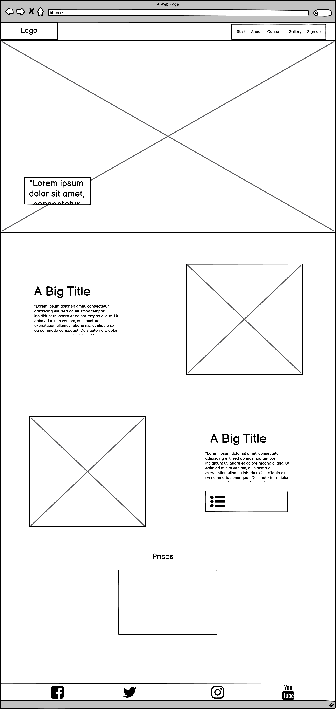
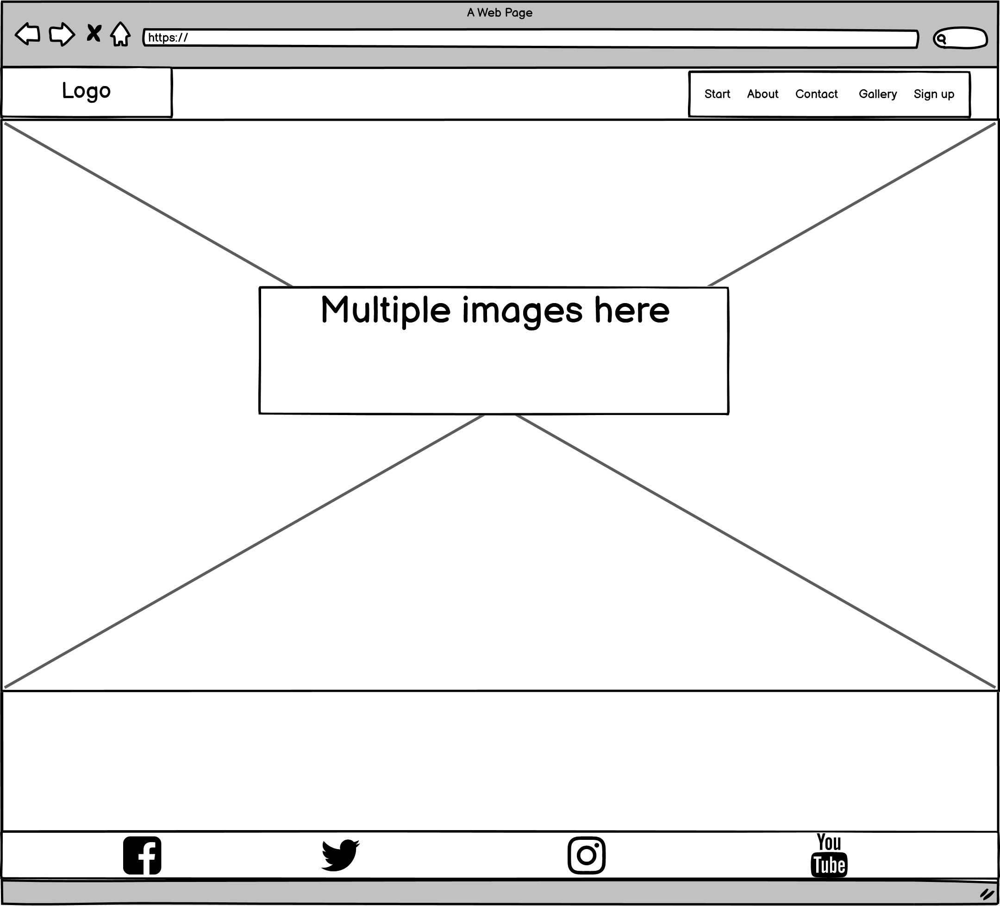
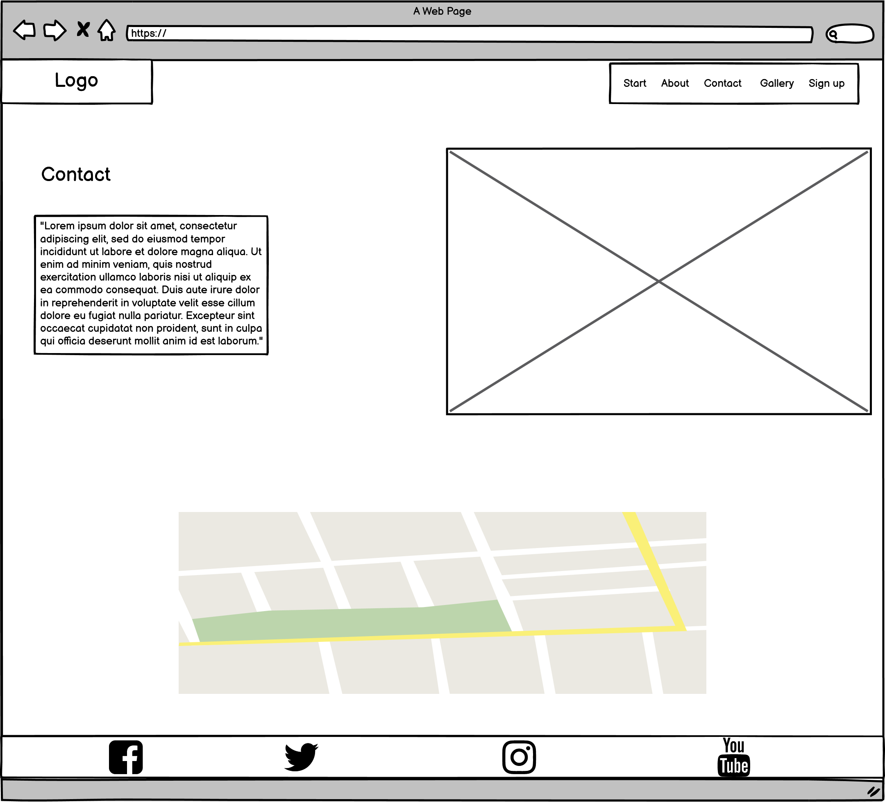
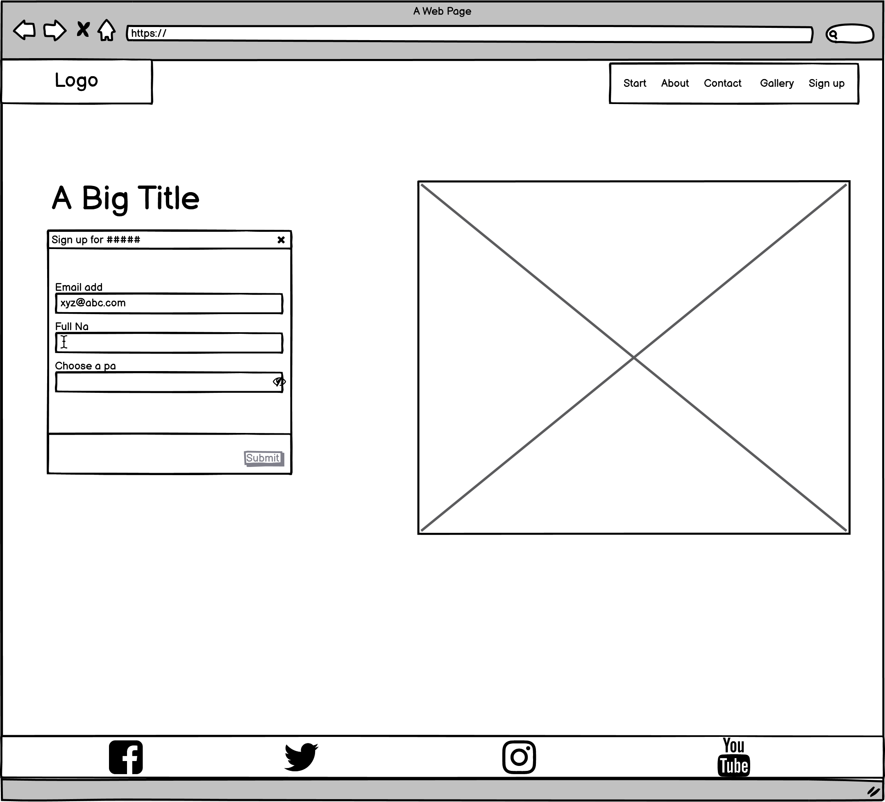
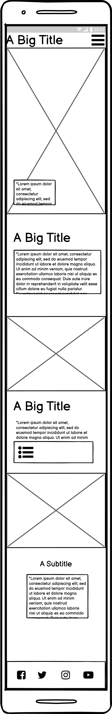
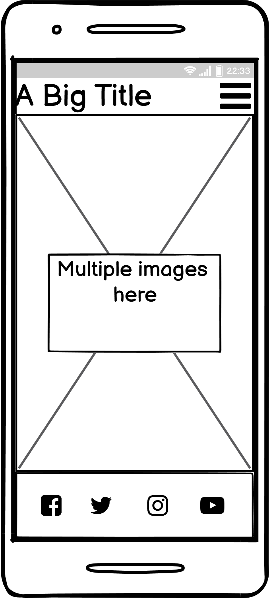
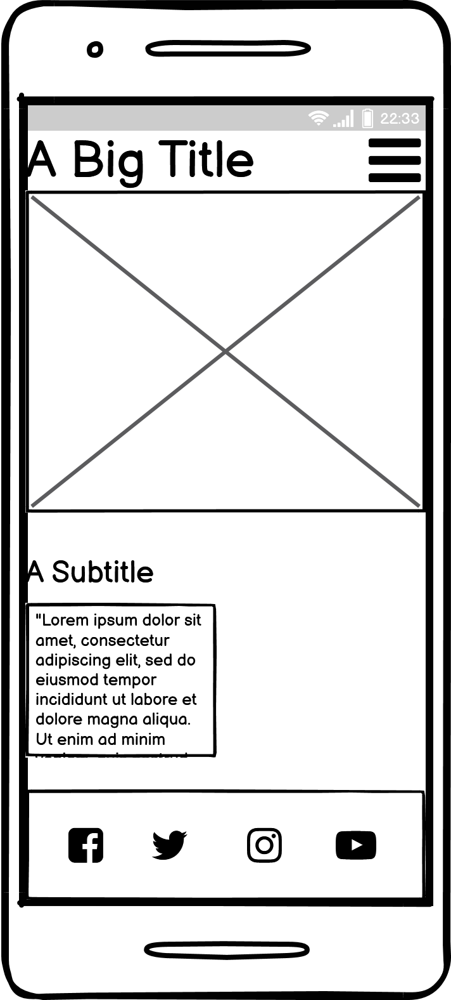
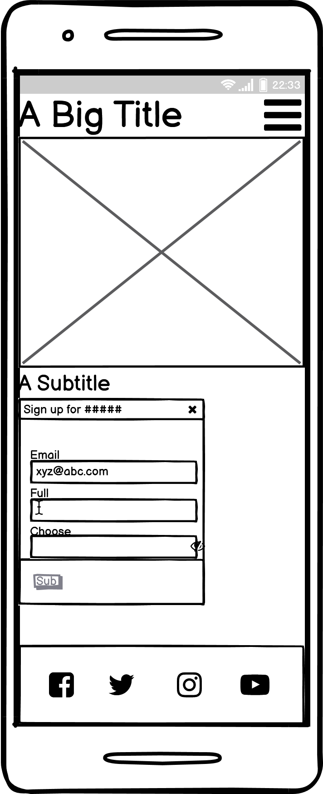
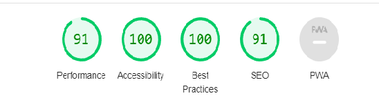

<h1 align="center">Café Click & Kick Website</h1>


[View project here.](https://cakarlsson.github.io/Caf-Click-Kick-Project/)

This website is for a made-up internet café/gaming establishment. The site is responsive to most devices and easy to navigate for users of all kind.


<h2 align="center"><!--Project on multiple devices here --></h2>


## User Experience (UX)


-   ### User stories


    -   #### First Time Visitor Goals


        1. As a First Time Visitor, I want to understand the website and be able to investigate more about the establishment.

        2. As a First Time Visitor, I want to be able to navigate fast on the website to learn more about the establishment.

        3. As a First Time Visitor, I want to know where i can find the establishment, what to expect and what the prices are.


    -   #### Returning Visitor Goals


        1. As a Returning Visitor, I want to be able to navigate to the gallery to watch pictures.

        2. As a Returning Visitor, I want to find social links.


    -   #### Frequent Visitor Goals

        1. As a Frequent Visitor, I want to easily see if new pictures has been added or if the establishment has updated of some sort.


-   ### Design

    -   #### Colour Scheme

        -  The Two main colors used are #FF6F61 (Coral) and #1E1E1E (Black). Some white has also been used.

    -   #### Typography

        -  The Krona One font was used for headers with a fallback of Sans Serif if for some reason Krona One won't load
        
        -  The Lato font was used for all other text in the body such as paragraphs, with a fall back of Sans Serif

    -   #### Imagery

        -   The imagery is there to set the mood, show information about the establishment and for the customer to see the establishment in action.


*   ### Wireframes


    -   Start screen Desktop Wireframe
    <h2 align="left"></h2>

    -   Gallery screen Desktop Wireframe
    <h2 align="left"></h2>

    -   Contact screen Desktop Wireframe
    <h2 align="left"></h2>

    -   Sign up screen Desktop Wireframe
    <h2 align="left"></h2>

    -   Start screen Mobile Wireframe
    <h2 align="left"></h2>

    -   Gallery screen Mobile Wireframe
    <h2 align="left"></h2>

    -   Contact screen Mobile Wireframe
    <h2 align="left"></h2>

    -   Sign up screen Mobile Wireframe
    <h2 align="left"></h2>


## Features


-   #### Navigation


        - At the top of the page in the header which navigates to different sections and pages of the website.


-   #### The Header


        - The header shows the contains the name of the establishment and the navigation bar.


-   #### About Us Section


        - The About us section contains details about the establishment and what it has to offer.


-   #### Setups Section


        - The Setups section contains details about the establishments equipment and setups.


-   #### The Price and Times Section

        
        - The Times part of the section gives the visitor an idea of when the establishment is open.

        - The Price part of the section gives the visitor information about the prices.


-   #### The Gallery Page


        - The Gallery contains images of the establishment and its customers to give the visitor a chance to see the customers feelings towards the establishment.

        - The Gallery also offers a chance for the visitor to see themselves if they participate in establishment photos.


-   #### The Contact Page


        - The Contact Page gives the visitor information on how to contact the establishment.

        - The Contact Page contains a Google Maps location pin point.


-   #### The Sign Up Page


        - The Sign Up Page gives the user a chance to sign up to the website.

## Technologies Used


### Languages Used


-   [HTML5](https://en.wikipedia.org/wiki/HTML5)

-   [CSS3](https://en.wikipedia.org/wiki/Cascading_Style_Sheets)


### Frameworks, Libraries & Programs Used


1. [Google Fonts:](https://fonts.google.com/)

    - Google fonts were used to import the Lato and Krona one fonts to the website.

2. [Font Awesome:](https://fontawesome.com/)

    - Font Awesome was used to import icons to the social network in the footer.

3. [Git](https://git-scm.com/)

    - Git was used for version control by utilizing the Gitpod terminal to commit to Git and Push to GitHub.

4. [GitHub:](https://github.com/)

    - GitHub is used to store the projects code after being pushed from Git.

5. [Balsamiq:](https://balsamiq.com/)

    - Balsamiq was used to create the wireframes during the planning process.


## Testing


The W3C Markup Validator and W3C CSS Validator Services were used to validate every page of the project to ensure there were no syntax errors in the project.


-   HTML

     - No errors were returned when passing through the official W3C validator

-   CSS

     - No errors were returned when passing through the official W3C validator

- Accessibility

    - I used the lighthouse tool from chrome dev tools to harmonize the colors.

<h2 align="center"></h2>
<h2 align="center"></h2>


### Testing User Stories from User Experience (UX) Section


-   #### First Time Visitor Goals


    1. As a First Time Visitor, I want to easily understand the main purpose of the site and learn more about the establishment.


        1. When visitors enter the site they are greeted with a clean navigation bar and a hero image.

        2. The user can scroll down to learn more about the establishment.

        3. The navigation bar is fixed on top and will always be available for easy navigation.


    2. As a First Time Visitor, I want to be able to easily navigate throughout the site to find details about the product.


        1. The navigation bar is fixed on top and will always be available for easy navigation.

        2. On every separate page there is a navigation bar that can take you back to the start or anywhere else to avoid feeling trapped.


-   #### Returning Visitor Goals


    1. As a Returning Visitor, I want to easily find the gallery.


        1. Using the navigation bar it takes the visitor to the gallery.


    2. As a Returning Visitor, I want to find community links.


        1. The social media links can be found at the footer of every page and will open a new tab for the user and more information can be found on each page.


### Further Testing


-   The Website was tested on Google Chrome, Microsoft Edge and Safari browsers.

-   The website was viewed on a variety of devices such as Desktop, Laptop, Iphone X Max.

-   A couple of friends and family helped reviewing and rating the website.


### Known Bugs


-   On the sign up page, the footer got stuck over the sign up form.

    -   Fixed


## Deployment


### GitHub Pages


The project was deployed to GitHub Pages using the following steps...


1. Log in to GitHub and locate the [GitHub Repository](https://github.com/)

2. At the top of the Repository (not top of page), locate the "Settings" Button on the menu.

    - Alternatively Click [Here](https://raw.githubusercontent.com/) for a GIF demonstrating the process starting from Step 2.

3. Scroll down the Settings page until you locate the "GitHub Pages" Section.

4. Under "Source", click the dropdown called "None" and select "Master Branch".

5. The page will automatically refresh.

6. Scroll back down through the page to locate the now published site [link](https://github.com) in the "GitHub Pages" section.


### Forking the GitHub Repository


By forking the GitHub Repository we make a copy of the original repository on our GitHub account to view and/or make changes without affecting the original repository by using the following steps...


1. Log in to GitHub and locate the [GitHub Repository](https://github.com/)

2. At the top of the Repository (not top of page) just above the "Settings" Button on the menu, locate the "Fork" Button.

3. You should now have a copy of the original repository in your GitHub account.


### Making a Local Clone


1. Log in to GitHub and locate the [GitHub Repository](https://github.com/)

2. Under the repository name, click "Clone or download".

3. To clone the repository using HTTPS, under "Clone with HTTPS", copy the link.

4. Open Git Bash

5. Change the current working directory to the location where you want the cloned directory to be made.

6. Type `git clone`, and then paste the URL you copied in Step 3.


```

$ git clone https://github.com/YOUR-USERNAME/YOUR-REPOSITORY

```


7. Press Enter. Your local clone will be created.


```

$ git clone https://github.com/YOUR-USERNAME/YOUR-REPOSITORY

> Cloning into `CI-Clone`...

> remote: Counting objects: 10, done.

> remote: Compressing objects: 100% (8/8), done.

> remove: Total 10 (delta 1), reused 10 (delta 1)

> Unpacking objects: 100% (10/10), done.

```


Click [Here](https://help.github.com/en/github/creating-cloning-and-archiving-repositories/cloning-a-repository#cloning-a-repository-to-github-desktop) to retrieve pictures for some of the buttons and more detailed explanations of the above process.


## Credits


### Code


-   The navigation bar came for the follow post [W3 school post](https://www.w3schools.com/howto/howto_js_mobile_navbar.asp)

-   The footer bar and the sign up form was inspired by Code Instutite Love Running Project.


### Media


-   The images used for the page were taken from [here](https://www.pexels.com/).


### Acknowledgements


-   My Mentor for continuous helpful feedback.


-   The codeinstitute slack community helped a whole lot.
        
    


